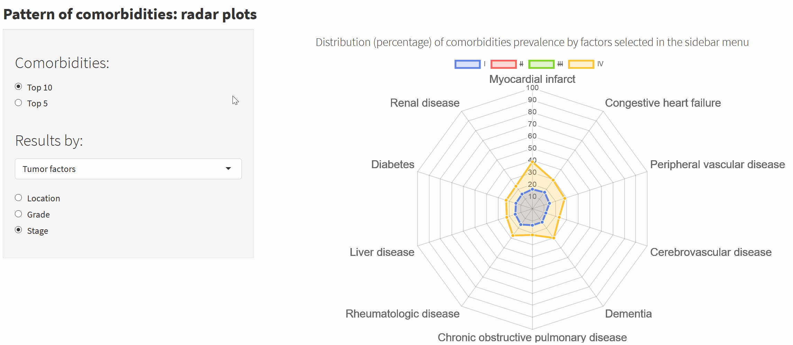

## Abstract

Cancer recurrence and disease-free survival are usually analysed in clinical trials. Cancer clinical trials usually enroll healthier and younger patients than the general cancer population. Therefore, cancer clinical trials population is unrepresentative for the real-world where comorbid elderly patients are the group with higher cancer incidence rates.

As part of the effort to evaluate real-world comparative effectiveness research and cancer survival outcomes, the population-based cancer registries of Granada and Girona identified all incident cases (n=1,061) from colorectal cancer patients. Detailed clinical information was collected from medical records as part of a High-Resolution European study (HIGHCARE project-Eranet TRANSCAN). The clinical information included patients and tumour characteristics, type of treatment and comorbidities status. Patients were followed until the end of December 2016 to assess their vital status.

CoMCoR project identified a consistent pattern of factors associated with a higher prevalence of comorbidities and multimorbidity at diagnosis and an increased time-to-surgery among patients with colorectal cancer with multimorbidity in Spain. This pattern may provide insights for further etiological and preventive research and help to identify patients at a higher risk for poorer cancer outcomes and suboptimal treatment. 

Furthermore, we found that multimorbidity was a strong independent predictor of short-term mortality at 6 months and 1 year among the colorectal cancer patients. The identified multimorbidity pattern was consistent. 

CoMCoR findings might help identify patients at a higher risk for poor cancer and treatment outcomes.

---------------------

## Articles

### - **Multimorbidity by Patient and Tumor Factors and Time-to-Surgery Among Colorectal Cancer Patients in Spain: A Population-Based Study.**
*Miguel Angel Luque-Fernandez, Daniel Redondo-Sanchez, Shing Fung Lee, Miguel Rodríguez-Barranco, Mª Carmen Carmona-García, Rafael Marcos-Gragera, María José Sánchez.*  
[Clinical Epidemiology](http://doi.org/10.2147/CLEP.S229935)

### - **Multimorbidity and short-term overall mortality among colorectal cancer patients in Spain: A population-based cohort study.**
*Miguel A.Luque-Fernandez, Karen Gonçalves, Elena Salamanca-Fernándeza, Daniel Redondo-Sanchez, Shing F.Lee, Miguel Rodríguez-Barranco, Mª C. Carmona-García, Rafael Marcos-Gragera, María-José Sánchez*   
[European Journal of Cancer](https://doi.org/10.1016/j.ejca.2020.01.021)

---------------------

## Apps

### - [CoMCoR](http://watzilei.com/shiny/CoMCoR/)

#### Comorbidities' frequency, distribution, and risk among colorectal cancer patients: A population-based high-resolution study in Spain.

[Reproducible code in GitHub](https://github.com/migariane/CoMCoR)

### - [TiMSurG](http://watzilei.com/shiny/timsurg/)

#### A Shiny App tool to evaluate time to surgery among colorectal cancer patients with comorbidities: A population-based high-resolution study in Spain.

---------------------

## About us

## **Non‐Communicable and Cancer Epidemiology Group, Biomedical Research Institute of Granada (ibs.Granada)**

Carlos III Institute of Health, Grant/Award Number: CP17/002026

We are a team with expertise in Epidemiology, Biostatistics, Public Health, Social Sciences and Mathematics.

We develop our work at the [**Biomedical Research Institute of Granada**](https://www.ibsgranada.es/), based at the [**Granada Cancer Registry**](http://www.cancergranada.org), placed at the [**Andalusian School of Public Health**](http://www.easp.es/).

### **Miguel Ángel Luque Fernández, MA, MPH, MSc, PhD**
Senior Scientific Researcher of Epidemiology and Biostatistics  
Miguel Servet I Award, Carlos III Institute of Health  
Ibs.Granada, Andalusian School of Public Health.  
Cuesta del Observatorio, 4, 18080  
Granada, Spain    
[Hugo Academic Webpage](http://watzilei.com/maluque.html)  

Research Scientist Collaborator, Department of Epidemiology,    
Harvard TH Chan School of Public Health, Boston, MA, U.S.A.     
[HSPH Webpage](https://scholar.harvard.edu/malf)      
 
Assistant Professor of Epidemiology and Biostatistics (Honorary)   
Department of Non-Communicable Disease Epidemiology  
London School of Hygiene and Tropical Medicine, London, U.K.    
[LSHTM Academic Webpage](http://www.lshtm.ac.uk/aboutus/people/luque.miguel-angel)  

Biomedical Network Research Centers of Epidemiology and Public Health (CIBERESP), ISCIII, Madrid, Spain.

Tutorials [Link to Epidemiological and Statistical tutorials](http://migariane.github.io/)

###  [@watzilei](http://www.twitter.com/watzilei)

###   [@migariane](https://github.com/migariane)

###   *miguel.luque.easp at juntadeandalucia.es*

---------------------

### 

### **Elena Salamanca Fernández, MSc**

Research Assistant of Environmental Epidemiology. PhD student.

Biomedical Research Institute of Granada, ibs Granada. University of Granada.
Andalusian School of Public Health.
Cuesta del Observatorio, 4, 18080
Granada, Spain

Biomedical Network Research Centers of Epidemiology and Public Health (CIBERESP), ISCIII, Madrid, Spain 

Research Support Unit. San Cecilio Clinical Hospital, Granada.

Pollution Surveillance and Control Laboratory. Environment and Water Agency, Ministry of Environment, Junta de Andalucía.

###  [@E_salamanca](http://www.twitter.com/E_salamanca)

###   *elena.salamanca.easp at juntadeandalucia.es*

---------------------

### **Daniel Redondo Sánchez, Mathematician (BSc, MSc)**

Research Assistant of Epidemiology and Biostatistics.

Biomedical Research Institute of Granada, Andalusian School of Public Health.  
Cuesta del Observatorio, 4, 18080  
Granada, Spain

###  [@dredondosanchez](http://www.twitter.com/dredondosanchez)

###  [@danielredondo](https://github.com/danielredondo)

###   *daniel.redondo.easp at juntadeandalucia.es*

---------------------

---------------------

### Funding: 

Miguel Ángel Luque Fernández was supported by the Spanish National Health Institute Carlos III (Instituto de Salud Carlos III), Miguel Servet-I Investigator Grant/Award Number: CP17/00206-EU-FEDER and María José Sánchez for the Andalusian Department of Health, Grant Number: PI-0152/2017.

---------------------

